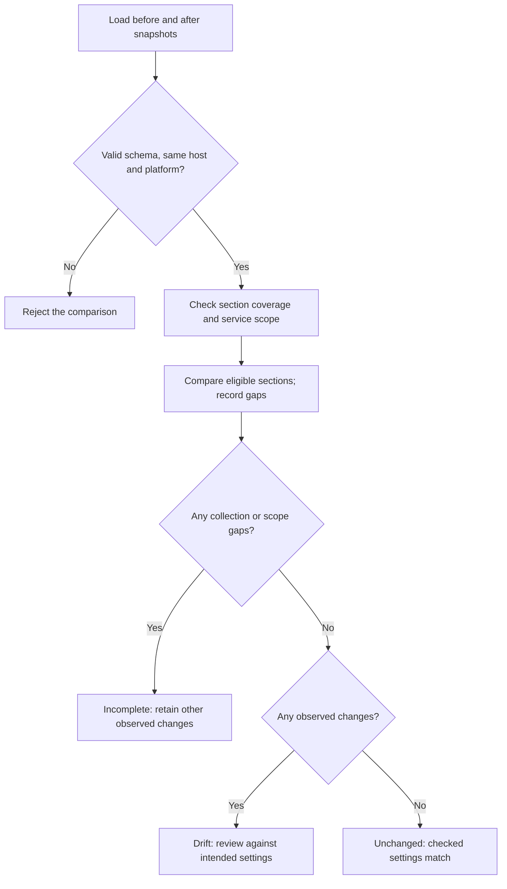

# Config Drift Watch

**See what changed between two saved snapshots of a Windows computer.**

A computer behaves differently after maintenance or a VPN change. Compare a known-good snapshot with a later one to find settings worth investigating.

[Download Windows app](https://github.com/thisisraihanm/config-drift-watch/releases/latest) · [Start here](START-HERE.md) · [Visual guide](docs/VISUAL-GUIDE.md) · [Technical reference](docs/TECHNICAL-REFERENCE.md)


## Try it in three steps

1. **Download and open.** On the [release page](https://github.com/thisisraihanm/config-drift-watch/releases/latest), download **ConfigDriftWatch-Windows.zip** under Assets, choose **Extract All**, then open **ConfigDriftWatch.exe**. Python is included.
2. **Try a safe example.** Click **Try a safe example**. It uses fictional data so you can learn what the results mean first.
3. **Use your own inputs.** Click **Save current settings** before and after a change. Select the two saved files and click **Compare saved settings**.

The tool reads and reports; it does not repair settings or copy/delete your files. See the [beginner guide](START-HERE.md) for help opening the unsigned Windows app and choosing the right download.

## See the result before installing


*Rendered from the actual HTML report with fictional demo data. This is a report preview, not a production result or Windows desktop screenshot.*

| Example item | Result | What you are seeing |
|---|---|---|
| DNS resolver order | Changed | 192.0.2.53 → 192.0.2.54 becomes 192.0.2.54 → 192.0.2.53. |
| Private firewall profile | Changed | Enabled changes from True to False. |
| Print Spooler | Changed | State changes from Running to Stopped. |

[See the detailed report image and decision flowchart →](docs/VISUAL-GUIDE.md)

## What happens inside



## Run the offline demo from source

Requires **Python 3.11+**. No pip packages are needed for the application. From this repository directory:

```sh
python config_drift_watch.py --demo
```

Open `reports/config-drift.html`. The neighboring JSON file contains the detailed evidence. Exit code **1** is expected because the fictional demo deliberately includes findings.

For the source desktop interface, install Python with Tcl/Tk and open `Start-Windows.cmd` on Windows, or run `python3 desktop.py` on Linux/macOS. Windows settings collection is available only on Windows.

## Scope and evidence

The Windows collector still needs validation on a real lab endpoint. Python comparison tests and PowerShell parsing do not prove on-device collection. Individual firewall rules, application health and many other settings are outside scope.

- [Visual walkthrough](docs/VISUAL-GUIDE.md): architecture, decisions and report previews.
- [Lab exercise](WALKTHROUGH.md): reproduce and explain the behavior.
- [Technical reference](docs/TECHNICAL-REFERENCE.md): commands, interpretation, limitations and official references.
- [Example HTML](docs/demo-report.html) and [JSON evidence](docs/demo-report.json): fictional demonstration output. Download the HTML to view it in a browser.
- [Automated checks](https://github.com/thisisraihanm/config-drift-watch/actions): inspect the run and commit before drawing conclusions.

Run the existing test suite with `python -m unittest discover -s tests -v`.

## Learning focus

PowerShell collection, Windows administration, configuration baselines, structured comparison and change investigation.

MIT licensed. Prepared with AI assistance for Raihan Mahmud's learning portfolio. No production deployment, business impact or operational recovery success is claimed.
