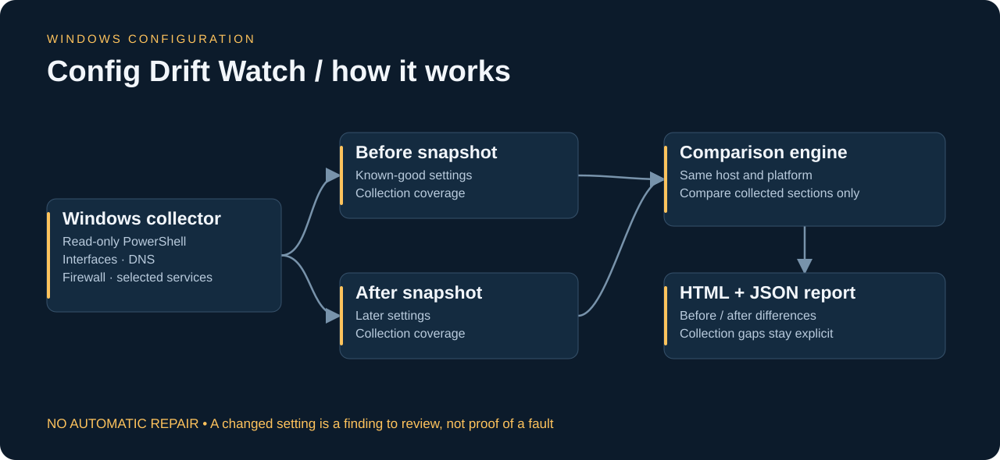
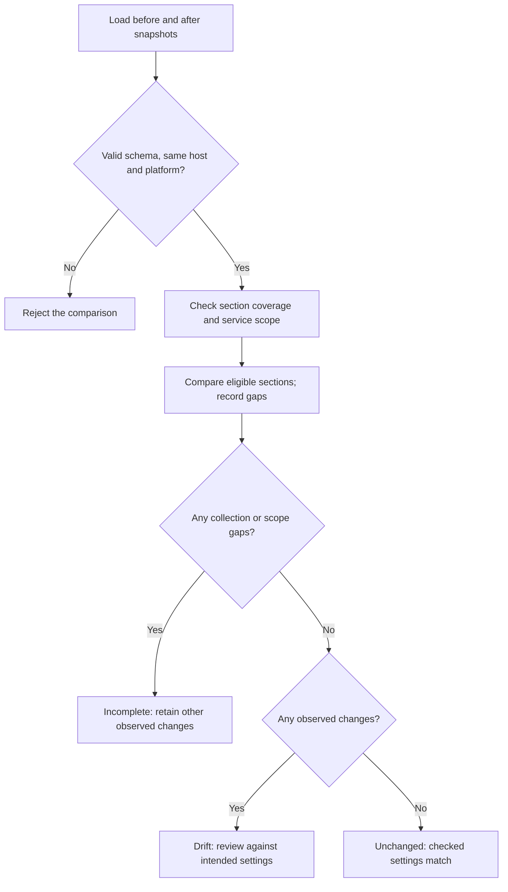
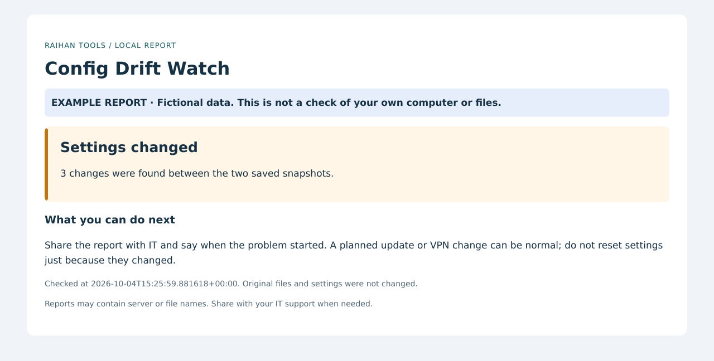
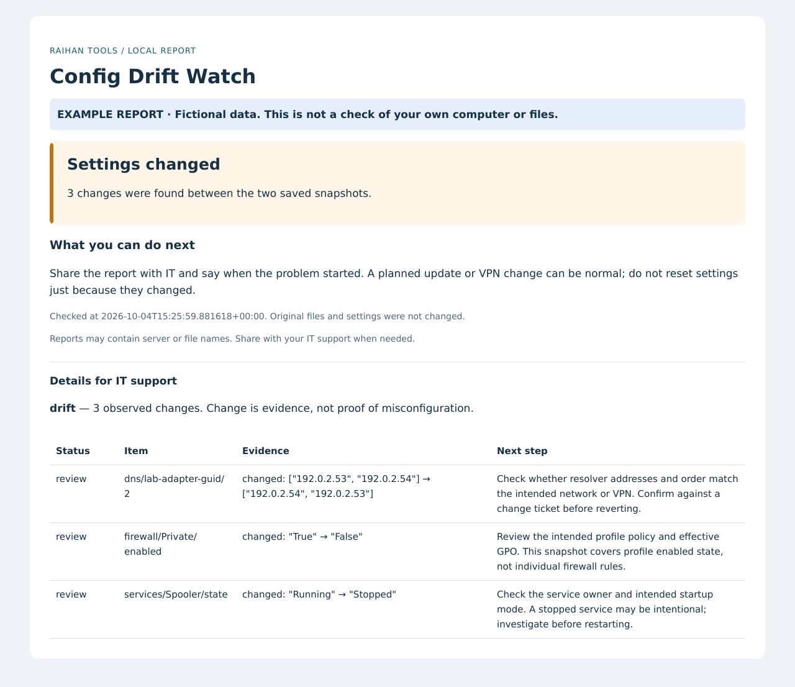

# Config Drift Watch — visual guide

[Back to the project](../README.md) · [Beginner steps](../START-HERE.md) · [Technical reference](TECHNICAL-REFERENCE.md)

## Follow the data



A computer behaves differently after maintenance or a VPN change. Compare a known-good snapshot with a later one to find settings worth investigating.

## Follow the decisions



The diagram summarizes the implementation. Error and incomplete states remain visible; a successful result applies only to the checks actually performed.

## Read an actual demo output

These images render the HTML produced by the current tool with its included fictional example data. They are report previews, not Windows desktop captures or production results. The detail image exposes the evidence table; timestamps reflect report generation or the supplied fixture.

### Plain-language overview



### Findings and suggested next steps



| Example item | Result | What you are seeing |
|---|---|---|
| DNS resolver order | Changed | 192.0.2.53 → 192.0.2.54 becomes 192.0.2.54 → 192.0.2.53. |
| Private firewall profile | Changed | Enabled changes from True to False. |
| Print Spooler | Changed | State changes from Running to Stopped. |

Download and open [the complete HTML report](demo-report.html), or inspect [the exact JSON evidence](demo-report.json). GitHub displays HTML as source; the images above show its rendered content.

## Connect the diagram to the code

| File | Responsibility |
|---|---|
| [Collect-Snapshot.ps1](../Collect-Snapshot.ps1) | Collects selected Windows settings and records section coverage. |
| [config_drift_watch.py](../config_drift_watch.py) | Validates snapshots and compares eligible sections. |
| [desktop.py](../desktop.py) | Provides guided snapshot selection and collection actions. |
| [tests/test_drift.py](../tests/test_drift.py) | Checks DNS order, missing coverage and host validation. |

## What this demonstrates

PowerShell collection, Windows administration, configuration baselines, structured comparison and change investigation.

The Windows collector still needs validation on a real lab endpoint. Python comparison tests and PowerShell parsing do not prove on-device collection. Individual firewall rules, application health and many other settings are outside scope.

## Reproduce these previews

Use Python 3.11+ from the repository root:

```sh
python config_drift_watch.py --demo --output docs/demo-report
python -m pip install -r docs/requirements-visuals.txt
python docs/render_previews.py
```

The demo intentionally returns exit code **1** because its data contains findings. That is expected. The rendering dependencies are optional documentation tools; the application itself does not need them. `render_previews.py` renders local HTML without browser access or external resources. It does not run live network checks or collect Windows settings.

The editable architecture source is [architecture.svg](images/architecture.svg); the flowchart source is [workflow.mmd](workflow.mmd).
